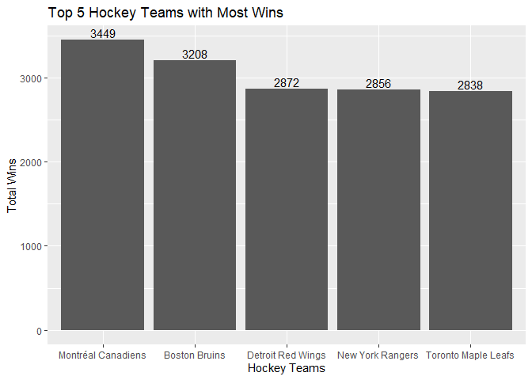
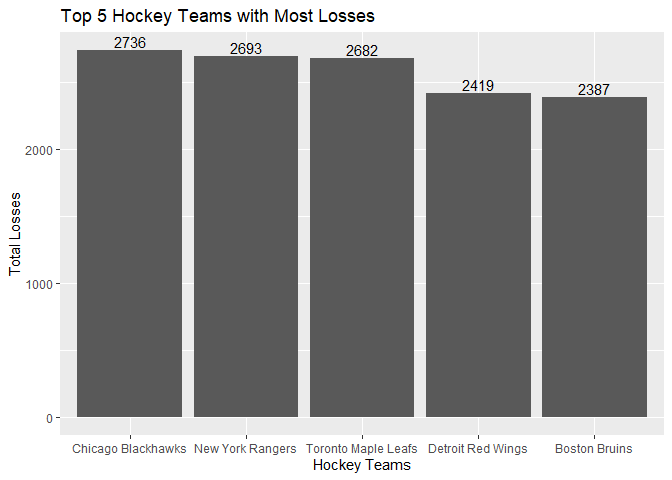
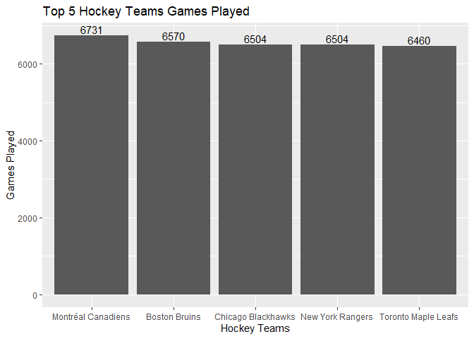

Project 1
================

  - [NHL](#nhl)
  - [Top Total Wins/Losses](#top-total-winslosses)
  - [Tampa Bay Lightning](#tampa-bay-lightning)
  - [Tampa Bay vs Atlanta Division
    Teams](#tampa-bay-vs-atlanta-division-teams)

## NHL

##### What is NHL

NHL stands for *National Hockey League* and currently has 31 teams. My
knowledge on the NHL is very small so first I wanted to know the teams
with the most wins and the most losses. To view the updated season,
check [this website](https://www.nhl.com).

## Top Total Wins/Losses

From looking at the bar charts, Montreal Canadiens has the most wins. An
interesting analysis I found is that Boston Bruins have the 2nd most
total wins but they have the 5th most losses. This makes me assume the
franchise was around longer than other teams as it’s in 2nd place for
most games played. If I were to choose to watch a team, it would be
Montreal Canadiens as they aren’t on the Top 5 Losses list. This makes
me believe they are the most successful franchise.

<!-- --><!-- --><!-- -->

## Tampa Bay Lightning

I currently reside in Tampa, Florida; so I did an analysis on the *Tampa
Bay Lightning*.Here is the roster for the current season.The roster has
a total of 27 active players.

**Active Roster**

| Jersey Number | Full Name          | Position Name | Position Type |
| :------------ | :----------------- | :------------ | :------------ |
| 35            | Curtis McElhinney  | Goalie        | Goalie        |
| 55            | Braydon Coburn     | Defenseman    | Defenseman    |
| 17            | Alex Killorn       | Left Wing     | Forward       |
| 22            | Kevin Shattenkirk  | Defenseman    | Defenseman    |
| 14            | Pat Maroon         | Left Wing     | Forward       |
| 27            | Ryan McDonagh      | Defenseman    | Defenseman    |
| 91            | Steven Stamkos     | Center        | Forward       |
| 24            | Zach Bogosian      | Defenseman    | Defenseman    |
| 2             | Luke Schenn        | Defenseman    | Defenseman    |
| 9             | Tyler Johnson      | Center        | Forward       |
| 77            | Victor Hedman      | Defenseman    | Defenseman    |
| 29            | Scott Wedgewood    | Goalie        | Goalie        |
| 18            | Ondrej Palat       | Left Wing     | Forward       |
| 20            | Blake Coleman      | Center        | Forward       |
| 86            | Nikita Kucherov    | Right Wing    | Forward       |
| 19            | Barclay Goodrow    | Center        | Forward       |
| 37            | Yanni Gourde       | Center        | Forward       |
| 88            | Andrei Vasilevskiy | Goalie        | Goalie        |
| 13            | Cedric Paquette    | Center        | Forward       |
| 23            | Carter Verhaeghe   | Center        | Forward       |
| 21            | Brayden Point      | Center        | Forward       |
| 81            | Erik Cernak        | Defenseman    | Defenseman    |
| 7             | Mathieu Joseph     | Right Wing    | Forward       |
| 67            | Mitchell Stephens  | Center        | Forward       |
| 71            | Anthony Cirelli    | Center        | Forward       |
| 98            | Mikhail Sergachev  | Defenseman    | Defenseman    |
| 44            | Jan Rutta          | Defenseman    | Defenseman    |

The table and histogram below shows the count for each position on the
Tampa Bay Lightning. Center is the highest count so I assume this must
be the most important position on the team or they are required more
during the game. There’s only 3 goalies and this makes sense as you only
need one goalie while the game is going on.

| Position   | Count |
| :--------- | ----: |
| Center     |    10 |
| Defenseman |     9 |
| Goalie     |     3 |
| Left Wing  |     3 |
| Right Wing |     2 |

Tampa Bay Lightning Position Name Count

<!-- -->

The table below shows the percentages for win, losses, and ot for the
Tampa Bay Lightning for the recent season. Since it is above 0.50, this
means the team is on the right track as they are winning more games than
losing or getting ot. To view their updated season, check [this
website](https://www.nhl.com/lightning).

| Win\_Percentage | Loss\_Percentage | OT\_Percentage |
| --------------: | ---------------: | -------------: |
|       0.6142857 |              0.3 |      0.0857143 |

Tampa Bay Lightning Win/Loss Percentage

## Tampa Bay vs Atlanta Division Teams

Tampa Bay Lightning is in the Atlantic Division along with 7 other
teams. Let’s see the Atlantic Division stats compared to each other.The
median seems to be around 33 and out of a season of 70 games, the median
for Atlantic Division could use some improvement overall.There’s a max
of 44 by Boston Bruins which means they’re doing well. Detroit has 17
wins which makes them a very weak team.

<!-- -->

From the plot below, we can see a trend that the higher the percentage
is that you out shoot the opponent, the higher wins you will get.

<!-- -->
