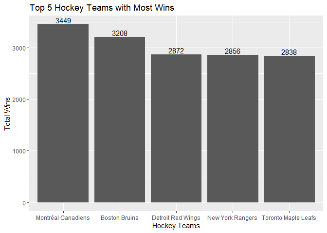
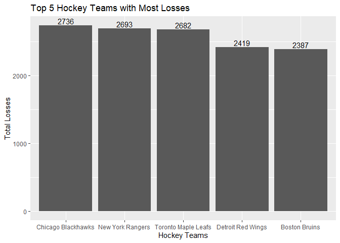
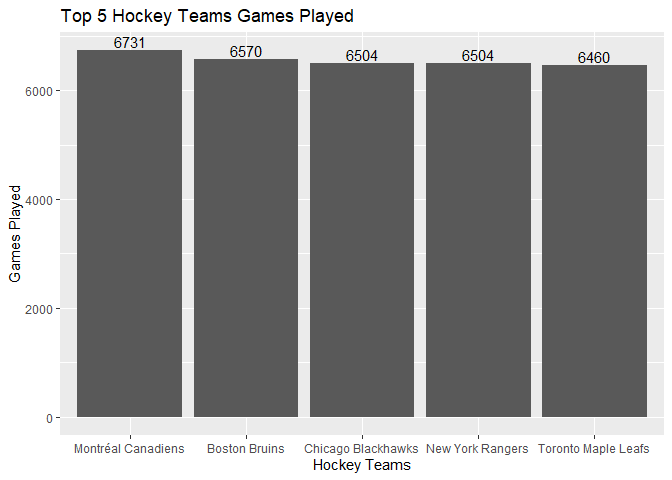

Project 1
================

# NHL

#### Info

##### What is NHL

NHL stands for *National Hockey League* and currently has 31 teams. My
knowledge on the NHL is very small so first I wanted to know the teams
with the most wins and the most losses. To view the updated season,
check [this website](https://www.nhl.com).

##### Top Total Wins/Losses

From looking at the bar chart, Montreal Canadiens has the most wins. An
interesting analysis I found is that Boston Bruins have the 2nd most
total wins but they have the most losses. This makes me assume the
franchise was around longer than other teams.

<!-- --><!-- --><!-- -->
